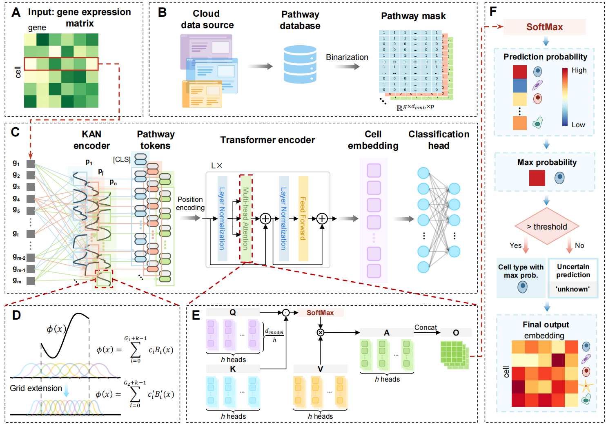

# KANotype: an interpretable biologically informed deep learning model with high accuracy for robust one-stop cell type annotation

## Contents

[Overview]: ##Overview
[Installation]: ##Installation
[Usage]: ##Usage


## Overview

KANotype is a biologically informed cell-type annotation model integrating KAN and Transformer. Through supervised training on the reference set, KANotype maps gene expression profiles of the query set to biologically interpretable latent representations. During preprocessing, typical scRNA-seq analysis steps — mainly including normalization and log1p transformation — are applied to the gene expression matrix, which subsequently serves as input to KANotype. The pathway gene sets obtained from the Molecular Signatures Database (MSigDB) are transformed into binary mask matrices to integrate prior biological knowledge into KANotype, enabling pathway-aware annotation. KANotype comprises three modules: a KAN-based token encoder, a Transformer layer with multi-head self-attention and a classification head for cell-type prediction.



## Installation

```shell
# create a new conda environment
conda create -n kanotype python=3.10

# activate the new env
conda activate kanotype

# install packages
conda install --file requirements.txt
```

## Usage

The code for running KANotype demo is in [run_kanotype.py](https://github.com/xycLab/KANotype/blob/master/run_kanotype.py)

**Input:**

* ref_ad: Anndata, reference dataset
* query_ad: Anndata, query dataset
* gmt_file: name of gene set file
* label_name: column name of cell type information in ref_ad
* result_dir: path to store the output files and logs

**Output:**

* result_dir/log: running information
* result_dir/adata: output Anndata object with cell type annotation results in the 'Prediction' column; the dimensions of count matrix are cell and pathway (not gene)
* result_dir/models: model weights of each training epoch